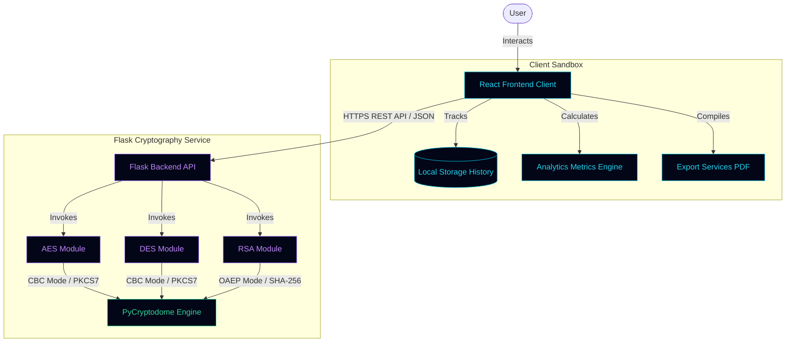
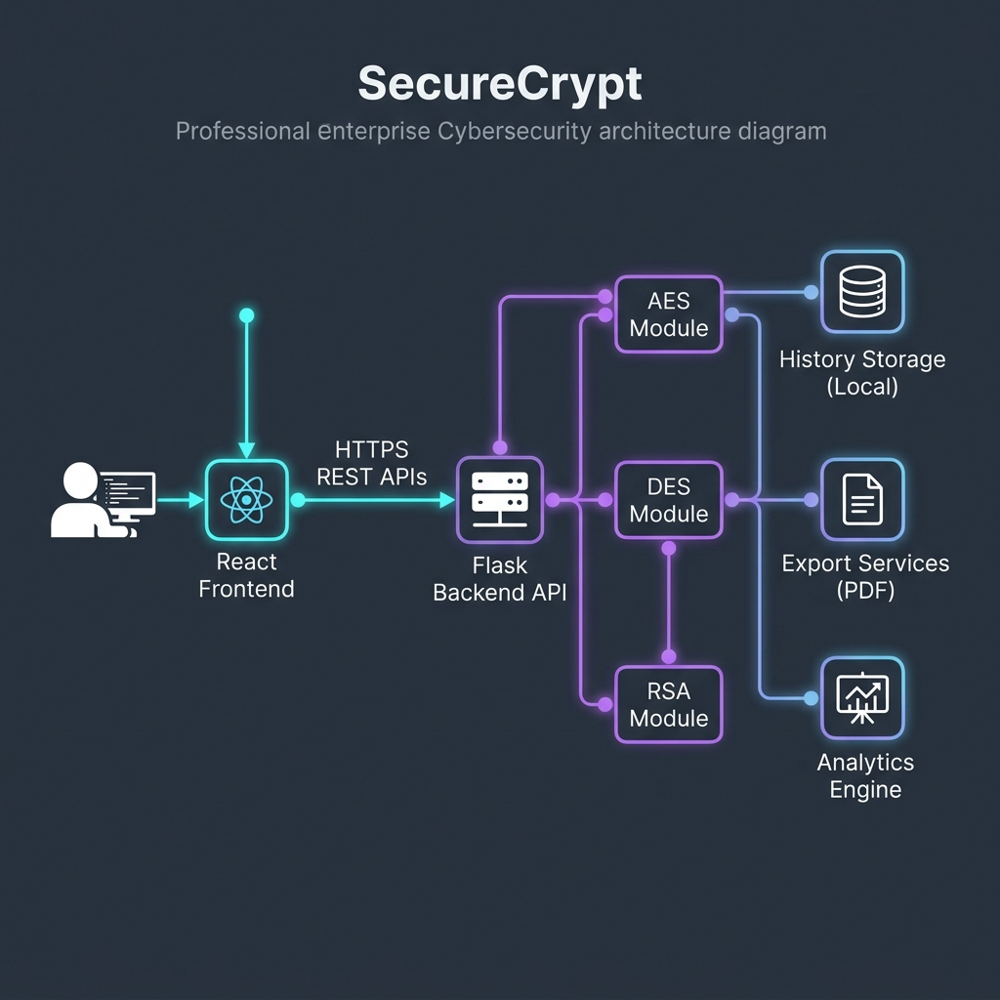

# SecureCrypt

🔗 Live Demo: https://secure-crypt-sandy.vercel.app/

🔗 GitHub Repository: https://github.com/anshi-4/SecureCrypt

A full-stack cybersecurity platform implementing AES, DES, and RSA cryptography with an interactive dashboard.

[](https://react.dev/)
[](https://vitejs.dev/)
[](https://www.python.org/)
[](https://flask.palletsprojects.com/)
[](https://opensource.org/licenses/MIT)

SecureCrypt is a high-fidelity, production-ready full-stack cybersecurity web application designed to demonstrate and analyze standard cryptographic workflows. The application provides an interactive, zero-knowledge dashboard enabling users to perform symmetric (**AES-256**, **DES**) and asymmetric (**RSA-2048**) encryption and decryption operations with real-time analytics, visual flowcharts, and detailed diagnostics.

---

## 🌟 Key Features

* **Multi-Algorithm Workspace**: Instantly switch between AES, DES, and RSA encryptions.
* **Real-Time Pipeline Visualizer**: Animated flowcharts illustrating the transition of data through inputs, key derivation steps, block ciphers, and outputs.
* **Key Strength Meter**: Real-time complexity evaluation for password inputs (checking length, character variety, and length constraints).
* **Local Storage Analytics Dashboard**: Caches successful runs in the browser's `localStorage` to compute throughput statistics and graph the most-used algorithms.
* **File Operations Ingestion**: Upload `.txt` plaintext files to encrypt contents, and download ciphertexts or generated RSA PEM keys as files.
* **Security Audit PDF Exporter**: Generate structured HTML security audit reports and print/save them as PDF with a single click.
* **Futuristic UX/UI**: Cyberpunk-themed glassmorphism interface featuring animated particle fields, neon glows, CRT scanlines, and a dark/light mode toggle.
* **Interactive Terminal Logs**: Emulated hacker console outputs incoming REST API request headers, body payloads, and status codes for debugging.

---

## 📚 Cryptographic Overview

| Feature / Metric | AES-256-CBC | DES-CBC | RSA-2048-OAEP |
| :--- | :--- | :--- | :--- |
| **Cipher Type** | Symmetric Block Cipher | Symmetric Block Cipher | Asymmetric Key Pair |
| **Key Size** | 256 bits (derived via SHA-256) | 56 bits (derived via SHA-256) | 2048 bits modulus |
| **Block Size** | 128 bits | 64 bits | Dynamic (Modulus limit) |
| **Padding** | PKCS7 Padding | PKCS7 Padding | OAEP Padding (SHA-256) |
| **IV Requirement** | 16-byte random IV | 8-byte random IV | N/A |
| **Security Grade** | **Military/Government standard** | **Deprecated (Legacy only)** | **Excellent (Key exchange)** |
| **Max Payload Size**| Unlimited | Unlimited | 190 bytes (Modulus limit) |

### 🛠️ Cryptographic Explanations

1. **AES-256-CBC**: SecureCrypt uses the Advanced Encryption Standard with a 256-bit key derived from user passwords using a single-round SHA-256 hash. Operations run in Cipher Block Chaining (CBC) mode with a cryptographically secure random 16-byte initialization vector (IV) generated per execution.
2. **DES-CBC**: Provided for legacy emulation and academic analysis. Key materials are derived by truncating a SHA-256 hash to 8 bytes. CBC block mode runs using an 8-byte random IV.
3. **RSA-2048-OAEP**: An asymmetric keypair cryptosystem using a 2048-bit modulus. Plaintexts are encrypted with a Public Key PEM and decrypted with a Private Key PEM. Optimal Asymmetric Encryption Padding (OAEP) with SHA-256 is used, capping the maximum message payload at 190 bytes.

---

## 🏗️ System Architecture

SecureCrypt implements a decoupled architecture integrating a responsive client frontend with a secure Python microservice.

### System Flowchart (Mermaid)



### Visual Architecture Diagram



* **Frontend Client**: Built on React 19 and Vite 8 with Tailwind CSS. Includes custom animation engines, local storage caches, and `canvas-confetti` celebrations.
* **Backend Microservice**: Built on Flask 3 with PyCryptodome. Provides zero-knowledge endpoints that process cryptograms without persisting user plaintexts or keys.

---

## ⚙️ Installation & Setup

### Prerequisites

Ensure you have the following packages installed:
* **Python 3.9+** & `pip`
* **Node.js v18+** & `npm`

---

### 1. Backend Service Setup (Flask)

1. Navigate to the `backend` directory:
   ```bash
   cd backend
   ```
2. Create and activate a Python virtual environment:
   * **Windows (PowerShell)**:
     ```bash
     python -m venv venv
     .\venv\Scripts\Activate.ps1
     ```
   * **macOS/Linux**:
     ```bash
     python3 -m venv venv
     source venv/bin/activate
     ```
3. Install dependencies:
   ```bash
   pip install -r requirements.txt
   ```
4. Run the API test checks:
   ```bash
   python verify_api.py
   ```
5. Launch the Flask API server:
   ```bash
   python app.py
   ```
   *The server binds to `http://127.0.0.1:5000`.*

---

### 2. Frontend Client Setup (Vite)

1. Open a new terminal and navigate to the `frontend` directory:
   ```bash
   cd frontend
   ```
2. Install node dependencies:
   ```bash
   npm install
   ```
3. Run the client development server:
   ```bash
   npm run dev
   ```
4. Build the client bundle for production (optional):
   ```bash
   npm run build
   ```
   *Open your browser and navigate to `http://localhost:5173` to explore the suite.*

---

## 🖥️ Usage Instructions

### Symmetric Workflows (AES / DES)
1. Select the **AES** or **DES** tab in the workspace.
2. Enter a secret passphrase, or click **Auto-Generate Key** to generate a cryptographically random string. Check the key quality indicator bar.
3. Paste text into the **Plaintext Input Payload** box, or click **Upload .txt File** to load text from a file.
4. Click **Encrypt** to process. The ciphertext and random block IV will populate on the Results Board.
5. Click **Download TXT** or **Report (PDF)** to export your cryptograms.
6. Click **Decrypt** to revert the ciphertext block using the designated key and IV.

### Asymmetric Workflows (RSA)
1. Select the **RSA** tab in the workspace.
2. Click **Generate Keypair** to request a new 2048-bit RSA pair, or paste existing public/private keys in PEM format.
3. Use the Public Key PEM to **Encrypt** plaintext payloads up to 190 bytes.
4. Toggle key visibility or click **PEM** to download the keys locally.
5. Use the Private Key PEM to **Decrypt** ciphertexts.

---

## 🖼️ Screenshots Placeholder Section

> [!NOTE]
> Below are wireframe placeholder specifications for capturing dashboard images.

```
┌─────────────────────────────────────────────────────────────┐
│                      SECURECRYPT WORKSPACE                  │
├──────────────────────────────┬──────────────────────────────┤
│ 💻 Input & Cipher Select     │ 📝 Results Board & Status     │
│                              │                              │
│ - AES, DES, RSA tab bars     │ - Ciphertext Base64 viewer   │
│ - Key generation sliders     │ - Decrypted Text results     │
│ - Plaintext textarea         │ - Export PDF Report buttons  │
│                              │                              │
└──────────────────────────────┴──────────────────────────────┘
```

---

## 🚀 Future Improvements

* **Hybrid Encryption**: Combine AES and RSA workflows to allow large file encryptions using RSA-encrypted AES keys.
* **Additional Block Modes**: Support for GCM, CTR, and OFB block modes to analyze authentication tags and streams.
* **Elliptic Curve Cryptography (ECC)**: Support for ECDH key exchanges and ECDSA signatures.
* **WebAssembly Engine**: Migrate Python cryptography operations to local WebAssembly (WASM) for completely offline client-side processing.

---

## 👩‍💻 Developer Information

* **Lead Security Engineer**: Anshika Rathi
* **Specialization**: Enterprise Cryptographic Engineering, Full-Stack React Architectures
* **Tech Stack Focus**: React, Python, Flask, PyCryptodome, Cyber-Dashboards
